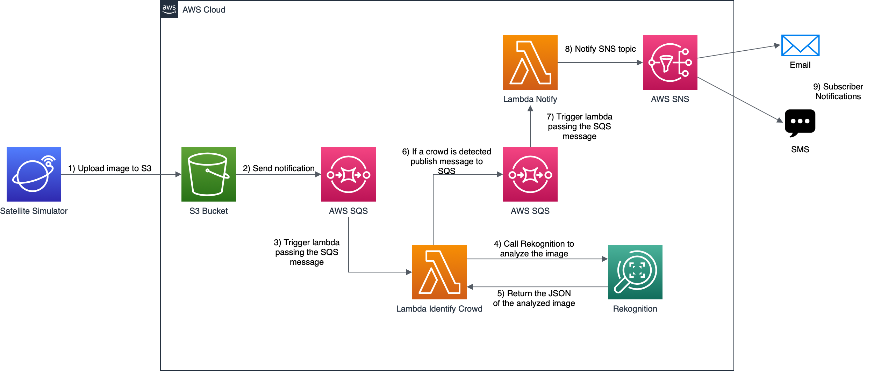
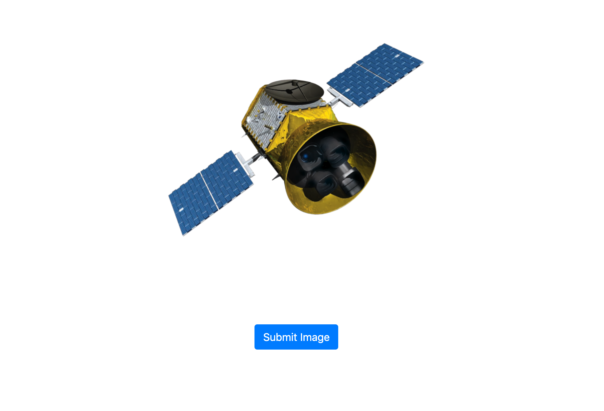
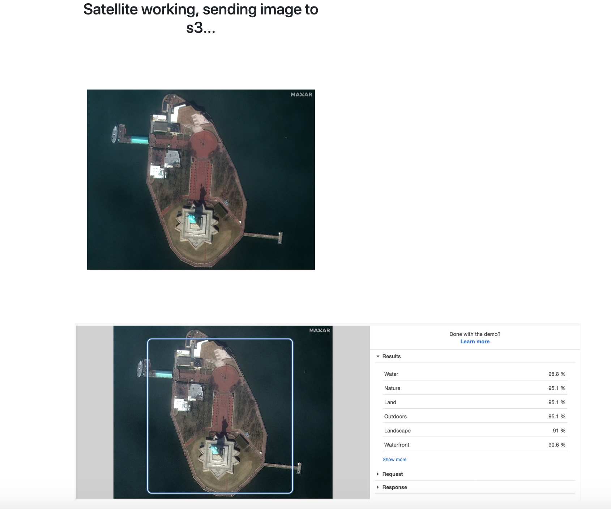

# Rekognition Demo

The purpose of this demo is to build a stack that uses Amazon Rekognition to recognize crowded places.

## Overview

This repository is a demonstration of how to use the feature Detect Labels of Amazon Rekogntion to rekognize places where a crowd environment is detected and send a notification to an email address, in this demo we will simulate a satellite that will provide image of crowded places and no crowded places to our system.

**This demo was tested on us-east-1 region**

## Prerequisites

- [Docker](https://docs.docker.com/get-docker/)
- [Docker Compose](https://docs.docker.com/compose/install/)
- [awscli](https://docs.aws.amazon.com/cli/latest/userguide/cli-chap-install.html)
- [Pre configured AWS credentials](https://docs.aws.amazon.com/amazonswf/latest/awsrbflowguide/set-up-creds.html)


## Architecture Diagram

<p align="center"> 

</p>

## Setup instructions

### Provision the infraestructure

You just need to run the cloudformation template to provision the infraestructure and all components

First you need to create a S3 bucket to store our application lambda code.

```shell
aws s3 mb s3://<MY_BUCKET_NAME>
```

ZIP lambda code.

```shell
zip ./lambda_package_crowd.zip lambda_recognize_crowd/lambda_function.py
```

```shell
zip ./lambda_package_notify.zip lambda-sns-notify/lambda_function.py
```

Upload the lambda packages to the S3 bucket that we created before.

```shell
aws s3 cp lambda_package_crowd.zip s3://<MY_BUCKET_NAME>/lambda_code/
```

```shell
aws s3 cp lambda_package_notify.zip s3://<MY_BUCKET_NAME>/lambda_code/
```

Now we need to create the stack using our Cloudformation template available in **cloudformation/** folder

```shell
aws cloudformation create-stack --stack-name sattelite-rekognition-stack --template-body file://cloudformation/rekognitionstack.yaml --parameters ParameterKey=StackName,ParameterValue=sattelite-rekognition-stack ParameterKey=BucketName,ParameterValue=<NEW_BUCKET_NAME> ParameterKey=BucketLambdaCode,ParameterValue=<BUCKET_NAME_THAT_WE_PROVISIONED_BEFORE> ParameterKey=SnsSubscriptionEmail,ParameterValue=<YOUR_EMAIL_ADDRESS> --capabilities CAPABILITY_IAM
```

Wait for the stack to be created.

### Local sattelite application.

Add some variables to our docker-compose.yaml file, go to **satellite-app/** folder.

```yaml
environment:
    BUCKET_NAME: "<NEW_BUCKET_NAME>"
    AWS_ACCESS_KEY_ID: "<YOUR_AWS_ACCESS_KEY_ID>"
    AWS_SECRET_ACCESS_KEY: "<YOUR_AWS_SECRET_ACCESS_KEY>"
    AWS_DEFAULT_REGION: "us-east-1"
```

Add the variables in docker-compose.yaml file, remember **<NEW_BUCKET_NAME>** is the name of the bucket that Cloudformation provisioned not the one we created early.

Start our application.

```shell
cd satellite-app && docker-compose up --build
```

Access our application in **http://localhost:5000**

The result will be that:
<p align="center"> 

</p>

Let's submit our image that will be analyzed, click in **Submit Image**

Our "Satellite" will send the image to Amazon S3 bucket and it will start the process of analyze our image.

<p align="center"> 

</p>

If is a crowded place you will receive an notification in the e-mail that you choose above in the Cloudformation template.

## Clean Up

Erase all objects in our Amazon S3 bucket that was provisioned by Cloudformation

```shell
aws s3 rm s3://<BUCKET_NAME_THAT_WAS_PROVISIONED_BY_CF> --recursive
```

Delete Cloudformation stack (It will delete all resources)

```shell
aws cloudformation delete-stack --stack-name sattelite-rekognition-stack
```

Delete bucket that we used to store our lambda code.

```shell
aws s3 rb s3://<MY_BUCKET_NAME> --force
```

## Security

See [CONTRIBUTING](CONTRIBUTING.md#security-issue-notifications) for more information.

## License

This project is licensed under the Apache-2.0 License.
